# gfx-by-stone

Old-skool graphics I made for the Commodore 64 computer in the previous millenium. 
Most of these were created in Koala Painter using a joystick to place every single pixel. 
They appear in various demos and are here ordered by csdb release ID, which is most probably not the order in which they were created.

## The Troopers - [Christmas '87](https://csdb.dk/release/?id=4732)

**Dølle's Christmas** - Multicolor bitmap

_This was pixeled after a cartoon by Tommy Sydsæter from the Norwegian "Pyton" magazine._

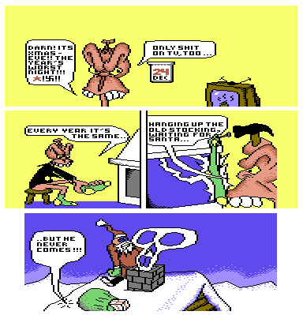

## The Troopers - [Stella Polaris](https://csdb.dk/release/?id=4734)

**Stella Polaris** - Multicolor with rasterbars

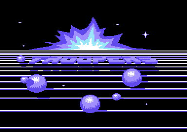

## The Troopers - [Dølle Døck](https://csdb.dk/release/?id=24458)

**Dølle Døck** - Multicolor bitmap

_This was pixeled after a cartoon by Tommy Sydsæter from the Norwegian "Pyton" magazine._

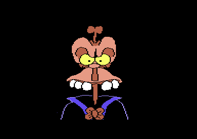

## The Troopers - [X-Press](https://csdb.dk/release/?id=24460)

**TROOPERS** - Hires chars with animated rasterbars

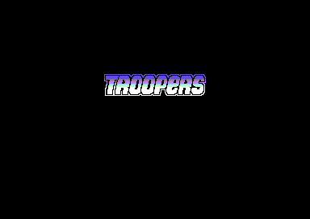

**TROOPERS** - Multicolor bitmap

_This was inspired by to logo for the game "Dropzone" by the legendary Archer MacLean, which itself was heavily inspired by the classic arcade game "Defender"_

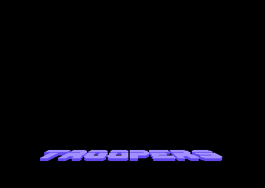

## The Troopers - [Destination](https://csdb.dk/release/?id=31790)

**TROOPERS** - Multicolor sprite logo

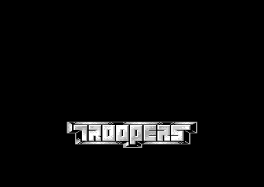

**STARS** - Multicolor sprite logo

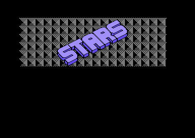

## The Troopers - [Magnetic](https://csdb.dk/release/index.php?id=32621)

**MAGNETIC** - Multicolor char logo with animated rasterbars 

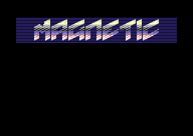

**TROOPERS** - Multicolor bitmap logo

_This was inspired by to logo for the game "Dropzone" by the legendary Archer MacLean, which itself was heavily inspired by the classic arcade game "Defender"_

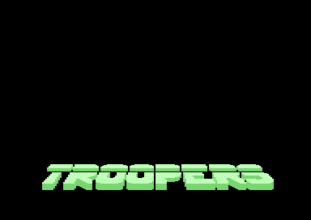

## The Troopers - [The Blue Touch](https://csdb.dk/release/?id=85966)

**STARS** (stripped) - Multicolor sideborder logo

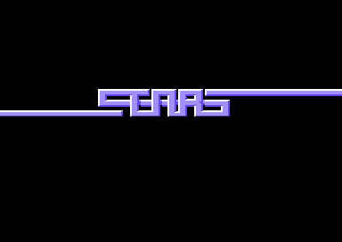

**STARS** (full) - Multicolor sideborder logo

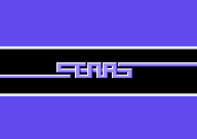

